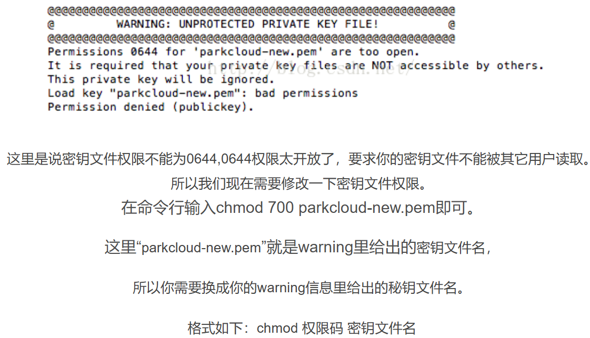

# Tehunical challenges and solution

1. 启用ssh
Solution: ```sudo service ssh start```

2. ```Permissions 0777 for '/etc/ssh/ssh_host_ed25519_key' are too open.```

Solution: ```chmod 700 /etc/ssh/ssh_host_ed25519_key```
